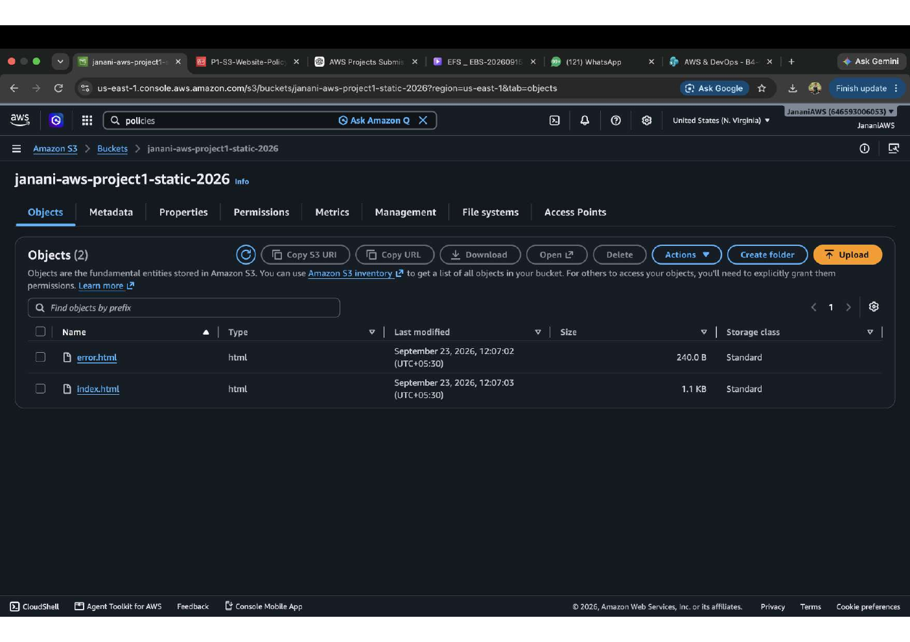
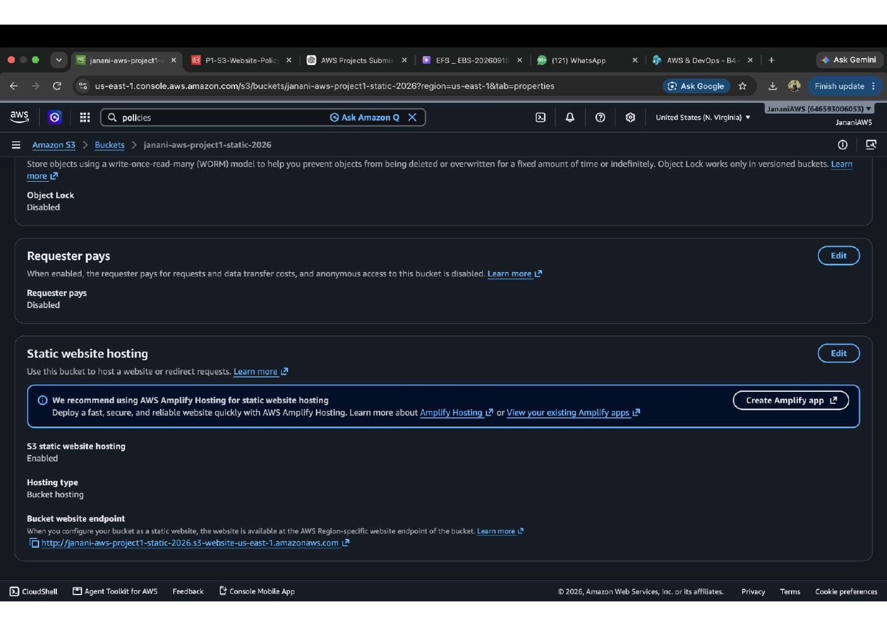
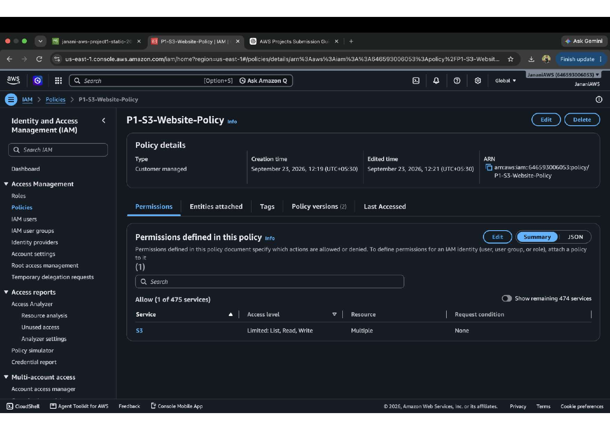
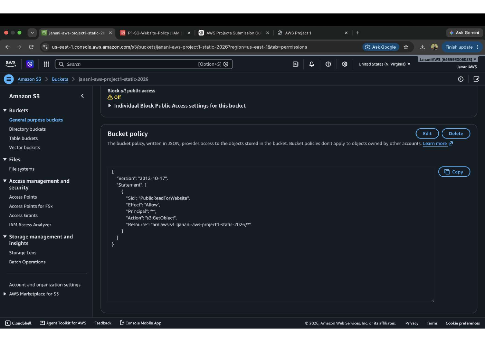
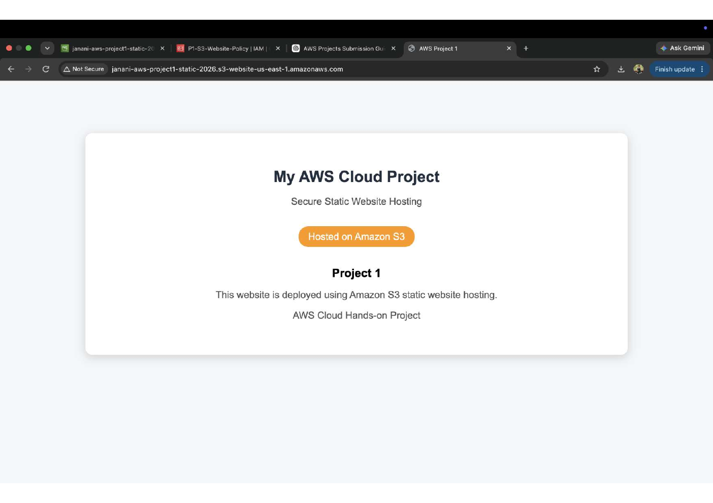
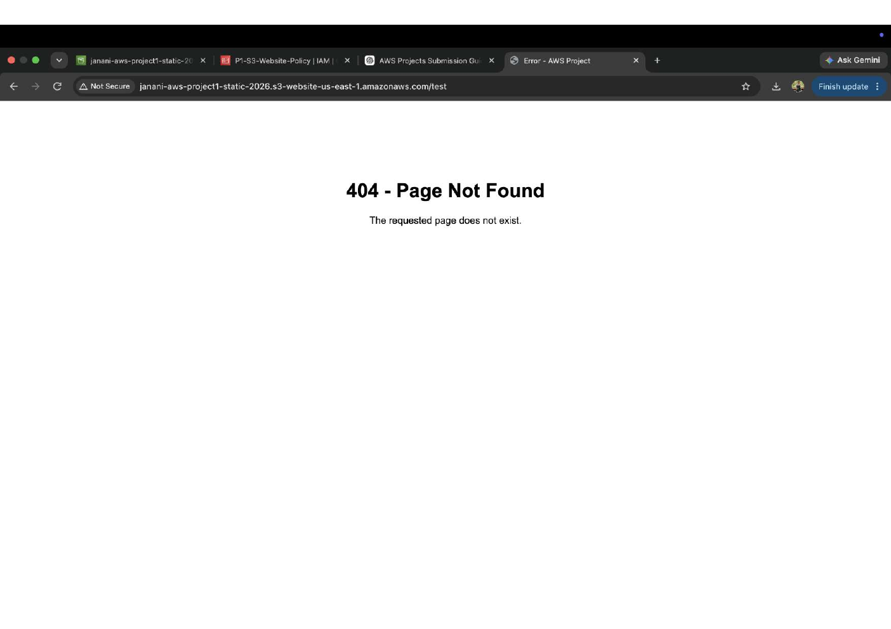

# Project 1 – Static Website Hosting on Amazon S3

## Overview

This project demonstrates how to deploy a static website using Amazon S3 static website hosting.

The website files were uploaded to an Amazon S3 bucket, static website hosting was enabled, and the required access policies were configured to make the website accessible through the S3 website endpoint.

## Objective

To deploy a static HTML website using Amazon S3 and configure the required access permissions and custom error handling.

## AWS Services Used

- Amazon S3
- AWS IAM

## Architecture

User
  |
  v
Amazon S3 Bucket
  |
  +--> index.html
  |
  +--> error.html
  |
  v
S3 Static Website Endpoint
  |
  v
Web Browser

## Implementation

### 1. Create S3 Bucket

Created an S3 bucket named:

`janani-aws-project1-static-2026`

The bucket was used to store the static website files.

### 2. Upload Website Files

Uploaded the following HTML files to the S3 bucket:

- `index.html`
- `error.html`

`index.html` serves as the main website page, while `error.html` is configured as the custom error page.

### 3. Enable Static Website Hosting

Enabled S3 static website hosting and configured the bucket for website hosting.

The website endpoint was generated by Amazon S3 and used to access the deployed website.

### 4. Configure IAM Policy

Created an IAM customer-managed policy named:

`P1-S3-Website-Policy`

The policy provides the required S3 permissions for the project.

### 5. Configure Bucket Policy

Configured the S3 bucket policy to allow public read access to the website objects.

The policy uses the `s3:GetObject` action for objects within the project bucket.

### 6. Validate Website Deployment

Accessed the S3 website endpoint through a web browser and verified that the static website was successfully displayed.

### 7. Test Custom Error Page

Tested a non-existent URL and verified that the configured custom error page was displayed with:

`404 - Page Not Found`

## Project Workflow

1. Create an S3 bucket
2. Upload static website files
3. Enable S3 static website hosting
4. Configure IAM permissions
5. Configure the S3 bucket policy
6. Access the S3 website endpoint
7. Validate the custom error page

## Key Concepts Demonstrated

- Amazon S3 static website hosting
- Object storage
- S3 bucket policies
- IAM policies
- Public object access
- Static website deployment
- Custom error page configuration
- Website endpoint validation

## Screenshots

### S3 Bucket Objects

### Static Website Hosting Configuration

### IAM Policy

### S3 Bucket Policy

### Deployed Website

### Custom 404 Error Page

## Outcome

Successfully deployed and validated a static website using Amazon S3 static website hosting, including access configuration and custom error-page handling.