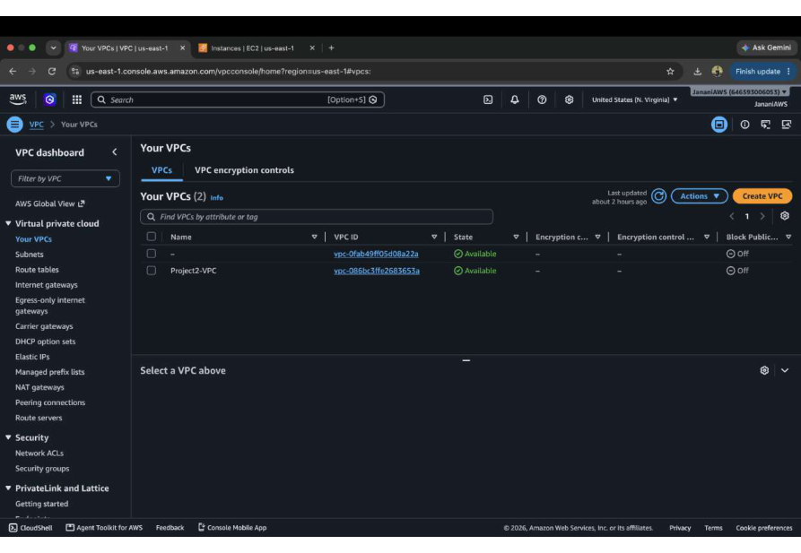
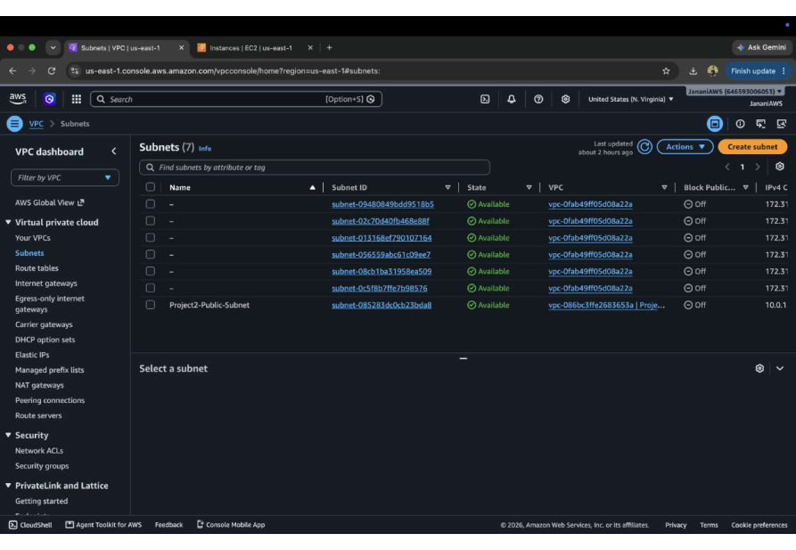
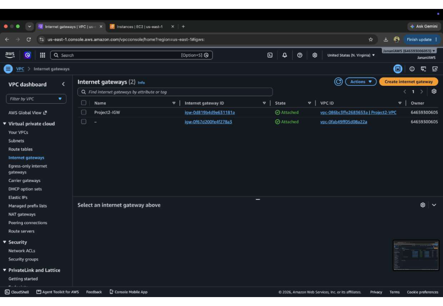
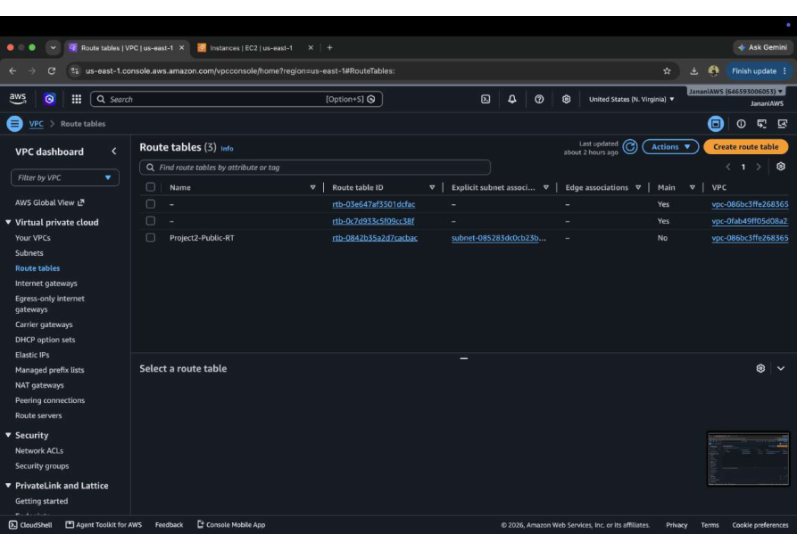
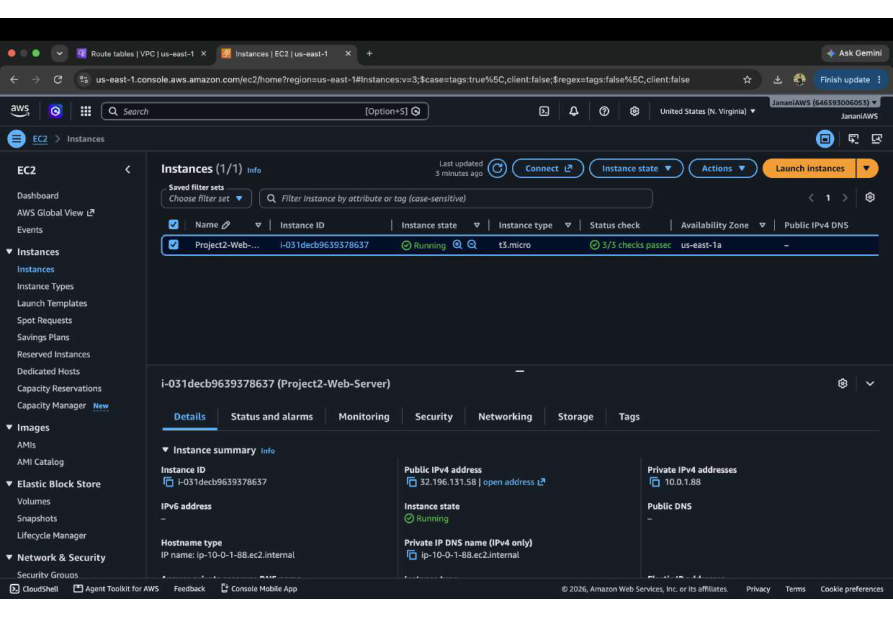
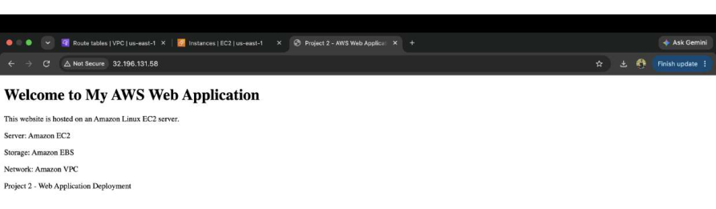
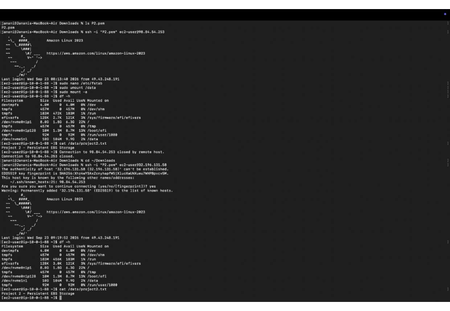

# Project 2 – EC2 Web Server with EBS Storage

## Overview

This project demonstrates how to deploy a Linux-based web server on Amazon EC2 within a custom Amazon VPC and configure additional Amazon EBS storage for the server.

The project covers the basic AWS networking components required to make the EC2 instance accessible and demonstrates how additional EBS storage can be attached, formatted, mounted, and validated from the Linux server.

## Objective

* Create a custom VPC and subnet for the application.
* Configure an Internet Gateway and route table for internet connectivity.
* Launch a Linux EC2 web server.
* Attach additional EBS storage to the EC2 instance.
* Format and mount the additional storage on the Linux server.
* Deploy and verify a basic web application.

## AWS Services Used

* Amazon VPC
* Amazon EC2
* Amazon EBS
* Internet Gateway
* Route Tables
* Subnets

## Architecture

```text
                    Internet
                       |
                       v
                Internet Gateway
                       |
                       v
              +------------------+
              |   Project2-VPC   |
              |                  |
              |   Public Subnet  |
              |        |         |
              |        v         |
              |  EC2 Web Server  |
              | Project2-Web-    |
              |     Server       |
              |        |         |
              |        v         |
              | Additional EBS   |
              |    Storage       |
              +------------------+
```

## Implementation

### 1. VPC Configuration

A custom VPC named `Project2-VPC` was created to provide an isolated network environment for the EC2 web server.

### 2. Subnet Configuration

A subnet was created inside the VPC to host the EC2 instance.

### 3. Internet Gateway

An Internet Gateway was attached to the VPC to provide internet connectivity for the public subnet.

### 4. Route Table

A route table was configured with an internet route through the Internet Gateway so that the EC2 instance could communicate with the internet.

### 5. EC2 Web Server

An EC2 instance named `Project2-Web-Server` was launched as the Linux-based web server.

The server was configured to host a basic web application and was successfully accessed through a web browser.

### 6. EBS Storage

An additional EBS volume was attached to the EC2 instance.

The additional storage was formatted with the XFS filesystem, mounted on the Linux server, and verified using Linux storage commands.

### 7. Application Validation

The deployed web application was accessed successfully from a browser, confirming that the EC2 web server was running correctly.

The Linux terminal was also used to verify the attached and mounted storage.

## Screenshots

### VPC Configuration



### Subnet Configuration



### Internet Gateway



### Route Table



### EC2 Instance



### Web Application



### Linux Storage Validation



## Outcome

Successfully deployed a Linux web server on Amazon EC2 inside a custom VPC and configured additional EBS storage for the server.

This project provided hands-on experience with AWS networking, EC2 deployment, EBS storage management, Linux storage commands, and basic web server deployment.

## Key Learning

* Creating and configuring an Amazon VPC
* Working with subnets and route tables
* Configuring Internet Gateway connectivity
* Launching and managing EC2 instances
* Attaching and managing EBS volumes
* Formatting and mounting Linux storage
* Deploying and validating a web application
